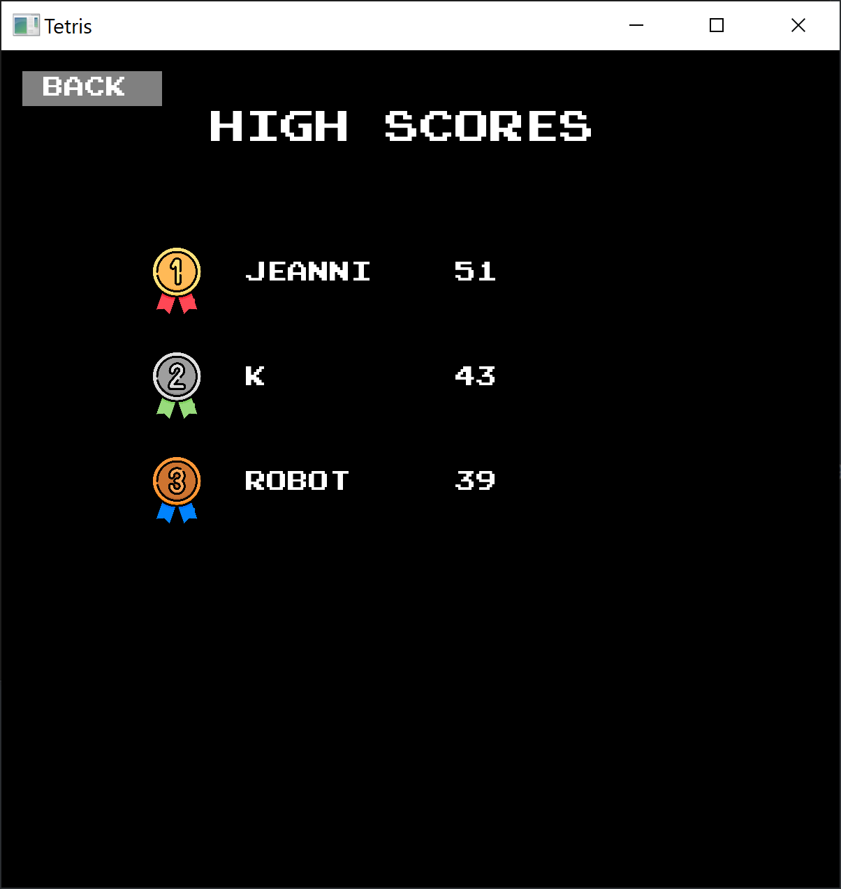
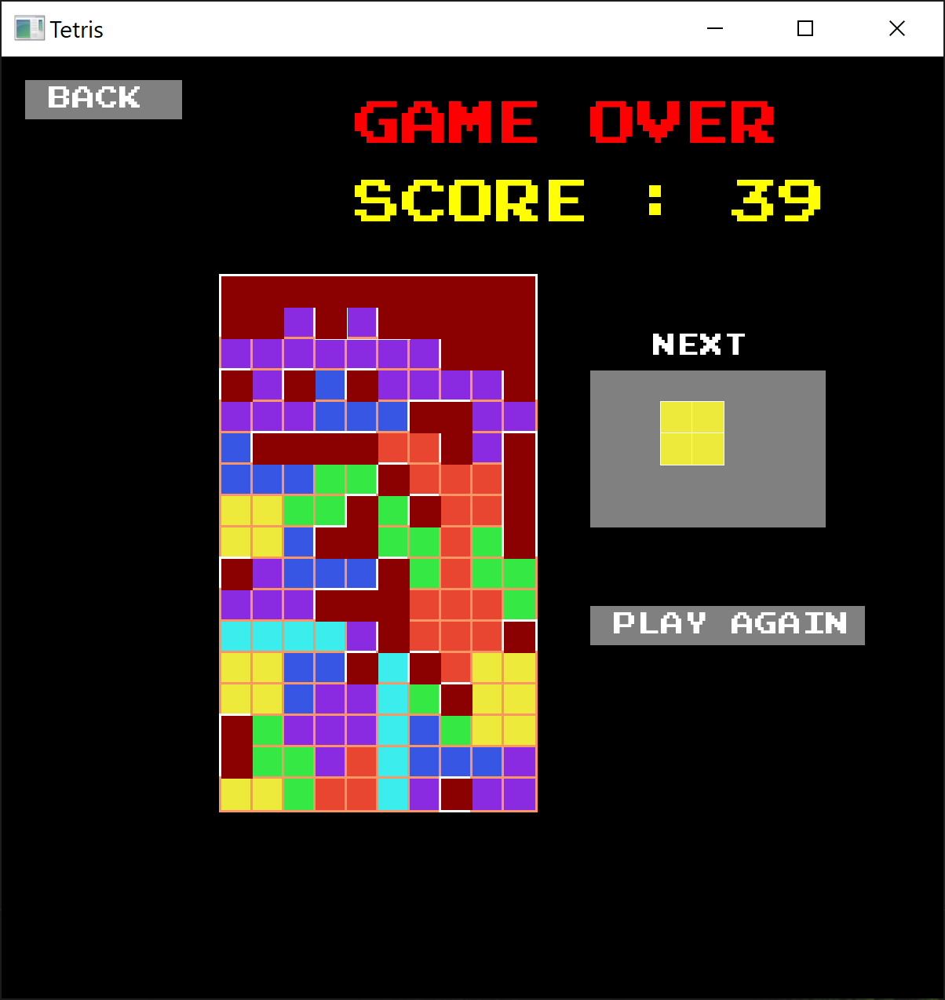

<!-- PROJECT LOGO -->
<br />
<p align="center">
  <a href="https://github.com/beannie-j/Tetris-SFML">
    
  </a>

  <h3 align="center">Tetris Game</h3>

  <p>
  </p>
</p>


<!-- TABLE OF CONTENTS 
## Table of Contents

* [About the Project](#about-the-project)
  * [Built With](#built-with)
* [Getting Started](#getting-started)
  * [Prerequisites](#prerequisites)
  * [Installation](#installation)
* [Usage](#usage)
* [License](#license)
* [Contact](#contact)

-->

<!-- ABOUT THE PROJECT -->
## About The Project

This is a simple Tetris game. Play and have fun!


Main Menu - Control with up and down arrow keys.<br />
<br />

Main Menu and Timer before game starts.<br />
<br />

Score Board - Displays top player scores<br /><br />
{:height="36px" width="36px"}.
Game Play<br />
<br />
Game Over<br />
{:height="36px" width="36px"}.

<!-- 
<a href="https://gyazo.com/ef6e5ed429343cf3999e1669322c61c5"></a>

GETTING STARTED 
Here's a blank template to get started:
**To avoid retyping too much info. Do a search and replace with your text editor for the following:**
`github_username`, `repo_name`, `twitter_handle`, `email`
-->

### Built With

* [SFML library](https://www.sfml-dev.org/)
* [SQLite](https://www.sqlite.org/index.html)


<!-- GETTING STARTED -->
## Getting Started

To get a local copy up and running follow these simple steps.

### Prerequisites

This project is available for Windows. You should also have Visual Studio 2019 installed from [here](https://visualstudio.microsoft.com/downloads/)


### Installation

1. Clone the repo
```sh
git clone https://github.com/beannie-j/Tetris-SFML.git
```
2. Run the GenerateProject.bat file. This should generate .sln file for you. Open the .sln file.
3. Build and run the project.


<!-- LICENSE -->
## License

Distributed under the MIT License. See `LICENSE` for more information.


<!-- CONTACT -->
## Contact

Jeannie An - [jeanniehjan@gmail.com](mailto:jeanniehjan@gmail.com) - email


